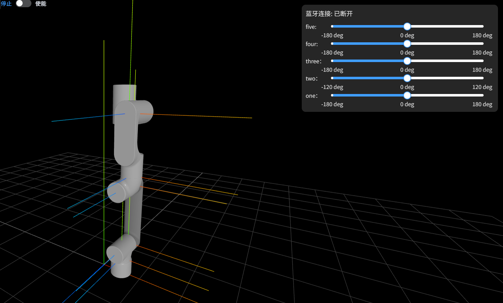
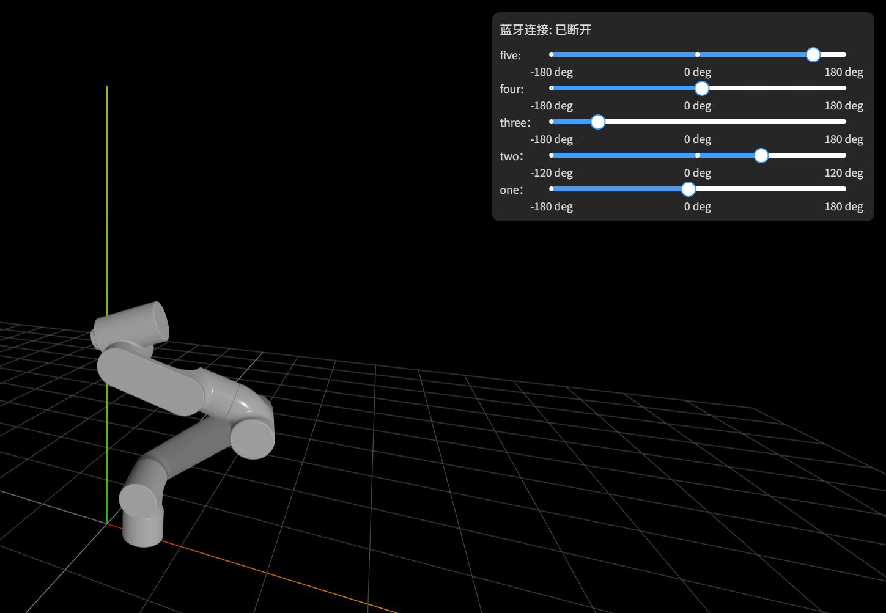

机械臂:

需要准备的物料:

## 单片机部分(esp32文件夹) :scream_cat: ： 
1. idf.py set-target esp32-s3 
2. idf.py build 
3. idf.py flash
4. idf.py monitor

## 前端部分（web文件夹） :scream_cat: ：
1. npm install
2. npm run dev

初始化🍺 ：

运行中示例💪 ：

